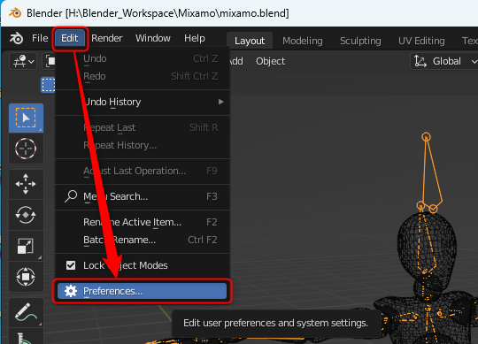
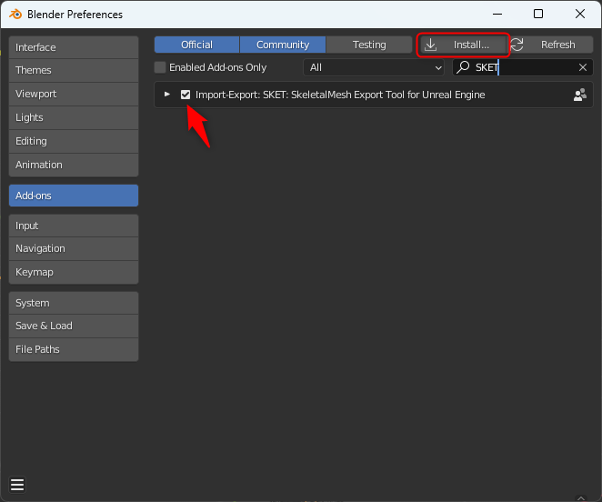

# 01. インストール

## 入手

### Release から

- [Releases](https://github.com/t-sumisaki/SKET/Releases) から `sket_unreal_vx.x.x.zip` を取得する

### ソースから

- リポジトリを取得、またはチェックアウトする
- リポジトリ内の `sket_unreal` フォルダを zip 圧縮する

## インストール

1. `Edit > Preferences...` を選択し、詳細設定画面を表示する  
   

2. `Addons` を選択し、右上の `Install` ボタンをクリックし、表示されたダイアログで、アドオンの zip ファイル（`sket_unreal.zip`）を指定する
3. `Import-Export: SKET: SkeletalMesh Export Tool for Unreal Engine` にチェックを入れて有効化する  
   
