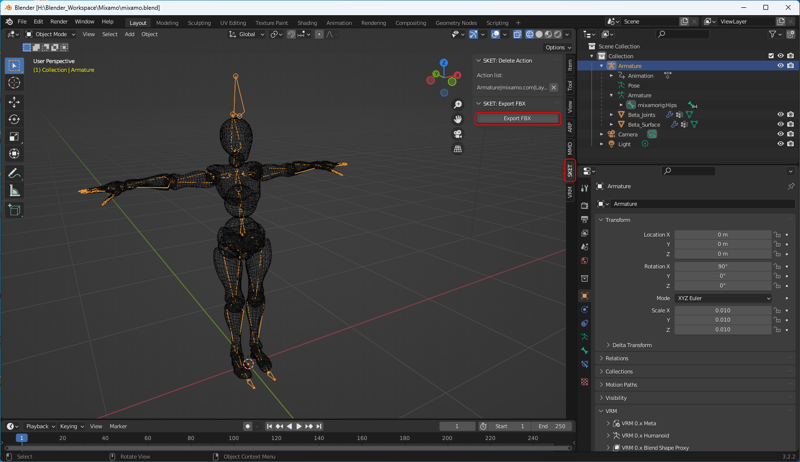
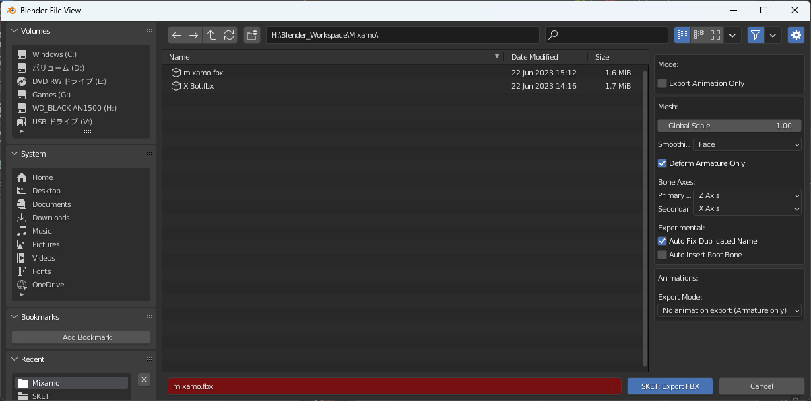

# 02. 使い方

## 基本的な使い方

1. 出力したい Armature を選択する
2. `SKET` タブにある `Export FBX` ボタンをクリックする  
   

3. ファイル名と出力先を指定し、 `SKET: Export FBX` をクリックする  
   

## 出力オプションについて

**Mode**

| Name                  | Description                | Default |
| --------------------- | -------------------------- | ------- |
| Export Animation Only | アニメーションのみ出力する | False   |

**Mesh**

| Name                  | Description                      | Default |
| --------------------- | -------------------------------- | ------- |
| GlobalScale           | 出力時のスケール                 | 1.0     |
| Smoothing             | スムージンググループの出力       | Face    |
| Deform Armature Only  | 変形用の Armature のみ出力するか | False   |
| Primary Bone Axis     | プライマリ方向                   | Z Axis  |
| Secondary Bone Axis   | セカンダリ方向                   | X Axis  |
| Auto Insert Root Bone | 原点にルートボーンを追加するか   | False   |

**Animations**

| Name                      | Description                  | Default              |
| ------------------------- | ---------------------------- | -------------------- |
| Export Mode               | アニメーションの出力モード   | All animation export |
| Separate FBX each actions | Action 毎に FBX を出力するか | False                |
